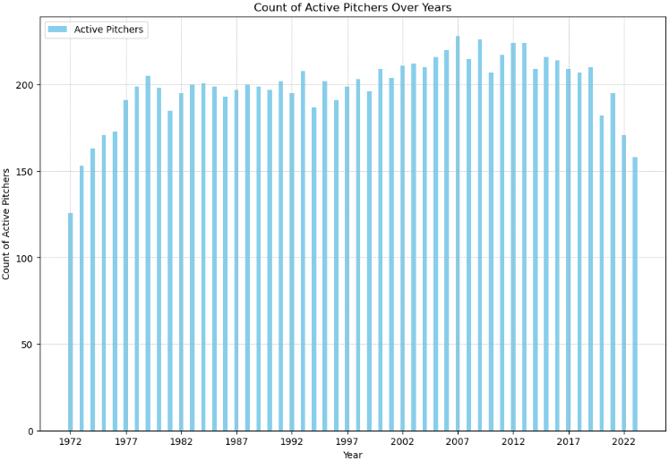
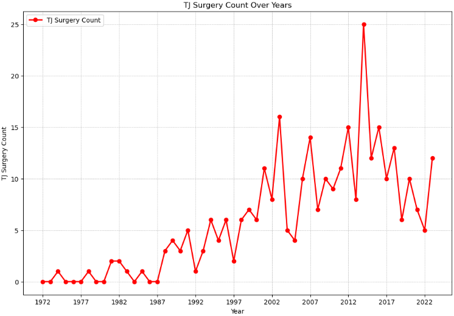
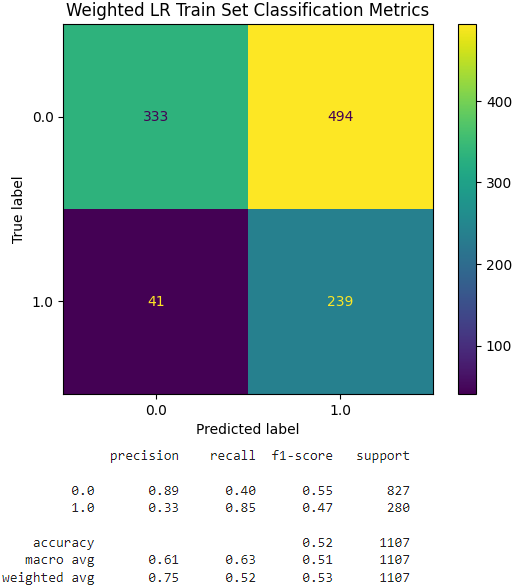
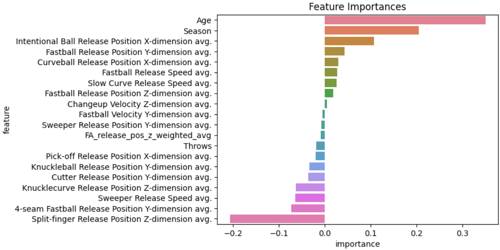

# Project_5_

## Overview
This project collected data from various resources on baseball statistics and built supervised machine learning models to predict the surgery status (Tommy John) of pitchers based on the available features.

## Business Understanding
Baseball is considered America's National Pastime. The game dates back to the early 1800's, and developed into a professional league after the Civil War. Today baseball is big business. With players signing contracts for hundreds of millions of dollars, owners want to not only protect their investment, but see a return on that investment. Before Tommy John, if a pitcher blew out their arm, it was considered a fatal blow to their career. After the successful surgery to Tommy John's UCL in 1974, this surgery has become much more common in pitchers today. Anywhere from professional players all the way to high school are undergoing this procedure. While this may save a players career, it requires a long recovery time and there is no guaruntee that this will be effective. Some players are unfortunate enough to undergo this procedure multiple times. This data was gathered from sites like baseball-reference.com, a running list of players who have undergone surgery, and the Python library 'pybaseball'. This project aims to look at the available advanced pitching statistics available and correctly predict if pitchers will need Tommy John surgery or not.

## Repository Navigation
The repository has several notebooks and a data folder. You will find the appropriate information within each specific file.

Data
- (1972-2023)_pitch_stats.csv
- all_(2008-2023)_stats_df.csv
- better_(2008-2023)_df.csv
- clean_tj_df.csv
- cleaning_filtered_df.csv
- complete_df.csv
- complete_100_df.csv
- cond_pivoted_df.csv
- final_(2008-2023)_df.csv
- hist_tj.csv
- modeling_df.csv
- pitcher_key_df.csv
- pivoted_df.csv
- savant_data.csv
- savant_data_results.csv
- tj_surgery_list.csv

Notebooks
- all_(2008-2023)_stats_cleaning
- Data_Cleaning_Notebook_1
- Data_Cleaning_Notebook_2
- Data_Cleaning_Notebook_3
- Data_Cleaning_Notebook_4
- Model_Notebook_1
- Model_Notebook_2
- Final_Notebook

## Presentation and Data Source
- Historic Seasonal Starting Pitching Data from Baseball-reference.com - [Link](https://www.baseball-reference.com/leagues/majors/2023-starter-pitching.shtml)
- TJ Surgery List from Google Docs - [Link](https://docs.google.com/spreadsheets/d/1gQujXQQGOVNaiuwSN680Hq-FDVsCwvN-3AazykOBON0/edit#gid=0)
- Python baseball library Pybaseball - [Link](https://pypi.org/project/pybaseball/)
- Presentation - [Link](https://docs.google.com/presentation/d/1nC4skWPs04aq8HSFh7sb7AwX3NmBQNQF0HUHMBmjggk/edit#slide=id.g2bf4da13b11_0_22)

## Data and Model Analysis
The data for this project has been collected, cleaned, and sorted for the final analysis.
Many tools were used in this process of analysis, including but not limited to pybaseball, pandas, numpy, sklearn, imblearn,  etc.
The first step was to gather and clean data in order to get a historic view of the number of starting pitchers in the MLB as well as the number of TJ surgeries since 1974 (to applicable pitchers, standards were starting pitchers only who have thrown a minimum of 320 career innings).

The next step was to collect data on Advanced Pitching Metrics, which was limited between the years of 2008 - 2023.
After cleaning and organizing this set of data, the target variable was set to "Surgery" as its values are binary (0 or 1), 0 meaning no surgery, & 1 meaning surgery.
Due to the nature of the collected data, pivot tables were made in order to accurately analyze the data, resulting in 129 features.
Because of this, I made two separate dataframes in order to test what would make the more effective models.
The first was the standard dataframe, the second one condensed pitch types & their associated metrics to generalized categories (fastball, breaking ball, off-speed, etc.).
Several models were attempted, including: Logistic Regression, Decision Tree, Random Forest, XG Boost, and KNN.
These models were adjusted via Grid Search to determine the best parameters specific to that model.
The best performing model was a Logistic Regression model, with a recall score of 85%.

This model employed a Standard Scaler to scale the various features, adjusted class weights to {0: 1, 1: 5}, score set to recall, C set to 0.01, penalty set to l1, tolerance set to 0.01, and max iterations set to 5000.
In order to better understand the affects of adjusting the class weights, I graphed the feature importance. The most important features were 'Age' and 'season' as those metrics would be an accumulation of wear-and-tear over time. After that were metrics such as fastball and curveball release position and average release speeds. 

## Conclusion
By the end of the process, the Logistic Regression was the most effective model, with a recall score of 85%.
This model employed a Standard Scaler to scale the various features, adjusted class weights to {0: 1, 1: 5}, score set to recall, C set to 0.01, penalty set to l1, tolerance set to 0.01, and max iterations set to 5000.
To further improve this model, I would like to gather more data and add more features including biological data, video analysis of pitching mechanics, advanced pitching data for years prior to 2008, data for international leagues, minor leagues, college, and various other factors like days rest, humidity, altitude, etc.
